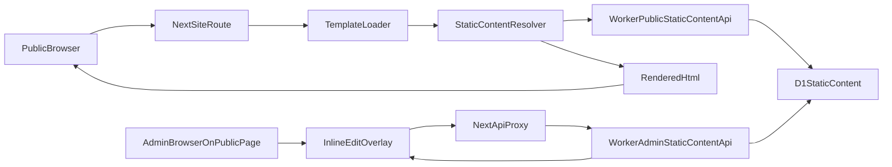

# Inline Editing Architecture

## Intent
Add admin-only inline editing to the existing public pages with the least disruption to the current site architecture.

The implementation should extend what already exists:
- static HTML templates remain the source templates for page structure
- Next route handlers continue to serve those templates
- the Worker remains the authenticated write boundary
- D1 stores the canonical static-copy values

## High-Level Flow



## Core Design Choices

### 1. Use a code-defined content registry
Do not make arbitrary text nodes editable.

Instead, define a registry of approved editable fields that describes:
- the `contentKey`
- the page or shared scope
- the field type
- the template selector or attribute hook
- any custom render behavior for non-trivial values

Why:
- protects layout and markup from accidental edits
- keeps the admin UI predictable
- makes validation and rendering deterministic
- avoids orphaned database keys

Suggested code artifact:
- `lib/staticContentRegistry.ts`

Example registry entry:

```ts
{
  key: "home.hero.tagline",
  pageId: "home",
  scope: "page",
  fieldType: "multiline_text",
  selector: "[data-content-key='home.hero.tagline']",
}
```

### 2. Mark editable regions in templates
Add stable DOM hooks to each approved editable surface.

Preferred approach:
- use `data-content-key` on the exact element that owns the visible text

Examples:
- `<h1 data-content-key="home.hero.tagline">...</h1>`
- `<p data-content-key="about.story.bodyOne">...</p>`
- `<a data-content-key="services.cta.button">Start a Conversation</a>`

Why this is preferred over comment markers:
- easier for the overlay to locate
- easier to replace with a DOM parser
- easier to review in source

Use a small wrapper element only when the visible value spans multiple nodes.

### 3. Resolve content server-side
The current `serveSiteFile()` path in `lib/siteFiles.ts` returns the raw file contents. The inline-edit system should evolve that path into:

1. load template HTML from disk
2. determine the page ID for the current route
3. fetch shared plus page-specific static content from the Worker
4. replace values in the HTML before building the response
5. optionally inject the admin overlay bootstrap script when an admin session is active

Why server-side substitution:
- public visitors receive final copy immediately
- crawlers and link unfurlers see the current content
- no client-side flash of default text
- keeps the site usable if admin JS fails to load

### 4. Keep persistence in D1, not source files
Do not reuse the `/*EDITMODE-BEGIN*/` file-rewrite approach seen in `index.html` and `tweaks-panel.jsx`.

That mechanism is useful as a proof that the UI can expose a lightweight editing panel, but it is not the right storage model for admin-managed copy because:
- it bypasses existing auth and API boundaries
- it couples editing to source control and file writes
- it does not scale cleanly across pages and shared copy

### 5. Use the existing same-origin admin path
The admin UI already talks to the Worker through the Next proxy at `/api/worker/*`.

Inline editing should do the same:
- browser calls `/api/worker/admin/static-content/*`
- HTTP-only cookie remains first-party on the site origin
- no new cross-site auth flow is needed

## Proposed Components

### Template loader
Existing:
- `app/route.ts`
- `app/[...slug]/route.ts`
- `lib/siteFiles.ts`

Recommended evolution:
- keep route handlers in place
- add a `renderSiteFile(routePath, request)` helper that can:
  - map route path to page ID
  - load template HTML
  - resolve static content
  - inject admin bootstrap script when appropriate

### Static content registry
Suggested responsibilities:
- enumerate editable keys
- map each key to page scope and selector
- define field types and validation intent
- flag shared vs page-local content

Suggested field types:
- `text`
- `multiline_text`
- `string_list`
- `faq_items`
- `team_members`
- `labeled_items`
- `email_parts`

Keep field types few and explicit.

### Static content resolver
Suggested responsibilities:
- fetch page payload from Worker
- parse HTML safely in Node
- replace `textContent`, option lists, or structured blocks based on registry rules
- leave the template default value in place if no database value exists yet

For simple text nodes:
- replace `textContent`

For structured surfaces:
- rebuild the exact child nodes for:
  - about team member cards
  - contact select options
  - service feature rows
  - FAQ entries
  - next-step rows
  - stack grid items

### Admin session detector
To avoid showing edit controls to visitors, add a lightweight session check.

Recommended option:
- Worker endpoint `GET /admin/auth/session`
- returns `200 { ok: true }` for a valid session
- returns `401` otherwise

The public page bootstrap script can call that endpoint once and only mount the overlay on success.

### Inline edit overlay
Recommended UX:
- fixed `Edit page` toggle in a corner
- hidden until session check passes
- when active, each editable node gets a small icon button aligned near its box
- click opens a compact popover or side drawer
- only one field edits at a time

Recommended editor behavior:
- short labels use `<input>`
- long copy uses `<textarea>`
- list fields use add/remove/reorder rows
- team members use a repeater with per-member edit, add, delete, and reorder controls
- save button disabled while request is in flight
- optimistic DOM update on success
- inline error on failure

Prefer a small custom overlay over `contenteditable`, because it is easier to validate and less likely to damage markup.

## Public Render Path

### Route-to-page mapping
Suggested page IDs:
- `/` and `/index.html` -> `home`
- `/about.html` -> `about`
- `/services.html` -> `services`
- `/contact.html` -> `contact`
- `/portfolio.html` -> `portfolio`

### Fetch shape
When rendering `about.html`, the resolver should request:
- all `scope = shared` entries
- all `pageId = about` entries

The response should be merged by `contentKey`.

### Fallback behavior
If the Worker is unavailable or a key is missing:
- render the template default already present in the HTML
- do not blank the node
- log the failure server-side for review

This keeps the marketing site resilient.

## Structured Content Guidance

### Buttons and plain copy
Store as strings.

### Repeated bullet lists
Store as string arrays.

Examples:
- service-card features
- contact next steps
- budget options
- service options

### FAQ
Store as an ordered array of objects:

```json
[
  {
    "question": "How do you price projects?",
    "answer": "We work on fixed-price contracts..."
  }
]
```

### Obfuscated email
Store as a small object rather than a single string:

```json
{
  "user": "juchheim",
  "domain": "gmail",
  "tld": "com",
  "displayText": "juchheim [at] gmail [dot] com"
}
```

This preserves the existing click-to-compose behavior.

### Team members (`about.team.members`)
Store as an ordered array of objects:

```json
[
  {
    "id": "trip-juchheim",
    "initials": "TJ",
    "name": "Trip Juchheim",
    "role": "Founder · Lead Engineer",
    "bio": "Full-stack engineer with twenty-plus years building for the web.",
    "accentStyle": "teal",
    "sortOrder": 1,
    "isActive": true
  }
]
```

Render guidance:
- the template keeps the card/container structure and classes
- the resolver rebuilds card nodes from `about.team.members`
- `isActive=false` entries are omitted from public render

## Rendering And Escaping Rules
- Treat all text as plain text, not HTML.
- Escape output before inserting into the DOM structure.
- Preserve line breaks only where the template explicitly supports them.
- Keep `<br>` and inline emphasis like `<em>` in the template, not the stored value.

For example:
- store `Straight talk. Solid delivery.`
- keep the template responsible for turning it into a two-line heading if that effect matters

## Recommended Implementation Files
These are not required names, but they fit the current structure well:
- `lib/staticContentRegistry.ts`
- `lib/staticContentResolver.ts`
- `lib/staticContentApi.ts`
- `app/admin/content/page.tsx` only if a fallback list view is later desired
- `worker-api/src/staticContent.ts` or similar helper module

## Non-Goals For The First Pass
- Rich text editing
- Reordering arbitrary sections
- Field-level audit history
- Draft/publish workflow
- Editing page metadata
- Editing portfolio case-study records from the public page shell
